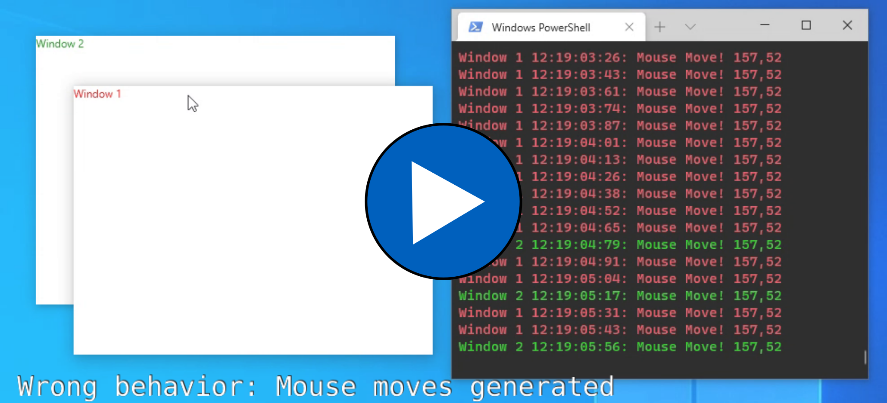

# WindowChrome Bug

This repository holds a simple application that demonstrates WPF bug with WindowChrome and mouse move events.

The bug requires two windows that both use WindowChrome. Windows should be set 
so that they overlap. Bug manifests when user starts moving the top most window
after entering its non client area from underlying window's client area. 
While moving the window WPF generates mouse move events to both window being dragged, and window below. 
This doesn't happen if user enters NCA area from window's client area, or from outside of the window.

This behavior can easily cause application lockups depending on 
what the app does in it's mouse move handler (for example initiates a Drag & Drop operation)

You can find video demonstration of the bug here:

The bug is a lot easier to reproduce with 
HKEY_CURRENT_USER\Software\Microsoft\Windows\CurrentVersion\Explorer\Advanced\DisallowShaking enabled

The bug has been observed with .NET Framework 4.8 and .NET Core 3.1.9

The bug seems to be in method 
[PossiblyDeactivate](https://github.com/dotnet/wpf/blob/f00f7adabea449ab91cdbd605b74bd7779a63e6b/src/Microsoft.DotNet.Wpf/src/PresentationCore/System/Windows/InterOp/HwndMouseInputProvider.cs#L894) 
because it fails to deactivate the window when moving from it's client area to another window's NCA.

